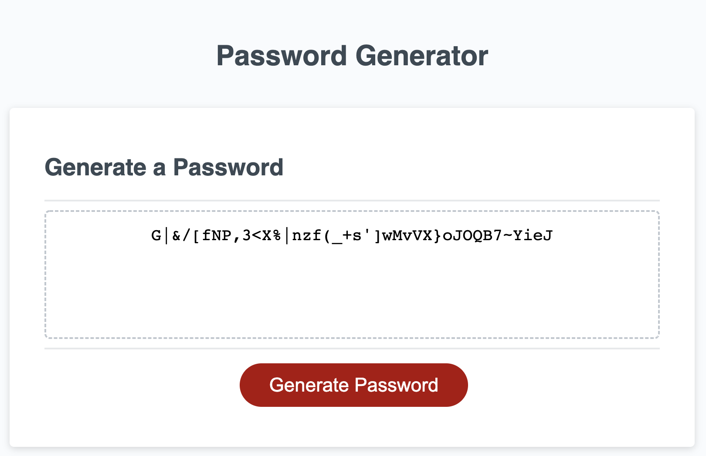

# Password-Creator
This is a password generator you can use to create a secure password your information!

I started by creating strings of possible characters.
I then created the windows that collected user input regarding upper and lowercase letters, numbers, and symbols. 
Next, I made the function that combined all of those strings based off the user input. If true, the next string is added, if false, the string is omitted.
Then, I made the generate password function that randomly selects the specific number of characters asked for from the finished string.
Lastly I changed the passwordtext.value to match the output of my generate password function.

[Deployed Application](https://blakelikestoast.github.io/Password-Creator/)

